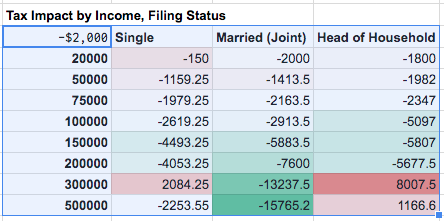
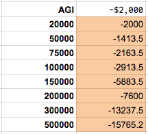

What-If Analysis, Google Sheets Add-On
===========

Replicates the Excel "What-If Analysis" feature, **Data Tables**.

In the future, I may add the other Excel features, e.g. **Scenarios**.

### Manual Installation*

You can simply copy the contents of the [`WhatIfAnalysis.gs`](WhatIfAnalysis.gs) file into a new script.

Step-by-step:

1. Within your Google Sheet, open the Script Editor (Tools > Script Editor)
2. Create a new script file, named WhatIfAnalysis.gs (File > New > Script file)
3. Paste the code from [`WhatIfAnalysis.gs`](WhatIfAnalysis.gs)
4. Save the script file (File > Save).
5. Reload your Google Sheet. 

\* This project is currently pending review as an Add-On. Hopefully, in the future, you can simply search for "What-If Analysis" in the Add-Ons store (in Google Sheets: Add-Ons > Get Add-Ons).

### Usage

After installing the add-on, you should have a menu item **What-If Analysis > Create Data Table**.

This will try to create a data table from the currently-selected cell range.

For example, to create a 2-dimensional (2-variate) Data Table, you need to select a range
where the model output (formula) is the top-left cell, and where the two sets of values
are provided along the first row and first column.  The add-on will fill in the rest of the cells.

To create a univariate Data Table, select 2 columns, with the model output (formula)
in the first row, second-column, and the test values in the first column.

### Data Refresh

For performance reasons, Data Tables are not recalculated automatically.

Use the **What-If Analysis > Refresh Data Tables** menu item to refresh all data tables.

You can also delete data tables by deleting the associated Named Range (**Data > Named Ranges**), 
which will be named in the form of *DataTable_RxCy*.  The deleted cell range will no longer be 
considered a "Data Table" and you may freely edit / clear the cells as normal.

### License

MIT License

Copyright (c) 2018 Jeffrey Yang

Permission is hereby granted, free of charge, to any person obtaining a copy
of this software and associated documentation files (the "Software"), to deal
in the Software without restriction, including without limitation the rights
to use, copy, modify, merge, publish, distribute, sublicense, and/or sell
copies of the Software, and to permit persons to whom the Software is
furnished to do so, subject to the following conditions:

The above copyright notice and this permission notice shall be included in all
copies or substantial portions of the Software.

THE SOFTWARE IS PROVIDED "AS IS", WITHOUT WARRANTY OF ANY KIND, EXPRESS OR
IMPLIED, INCLUDING BUT NOT LIMITED TO THE WARRANTIES OF MERCHANTABILITY,
FITNESS FOR A PARTICULAR PURPOSE AND NONINFRINGEMENT. IN NO EVENT SHALL THE
AUTHORS OR COPYRIGHT HOLDERS BE LIABLE FOR ANY CLAIM, DAMAGES OR OTHER
LIABILITY, WHETHER IN AN ACTION OF CONTRACT, TORT OR OTHERWISE, ARISING FROM,
OUT OF OR IN CONNECTION WITH THE SOFTWARE OR THE USE OR OTHER DEALINGS IN THE
SOFTWARE.
